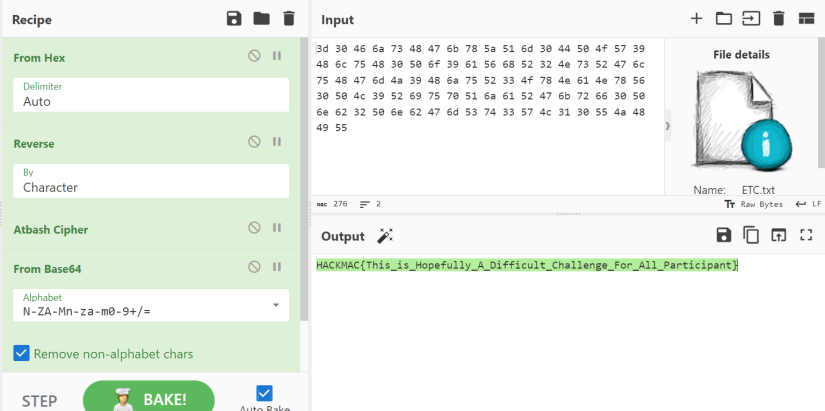
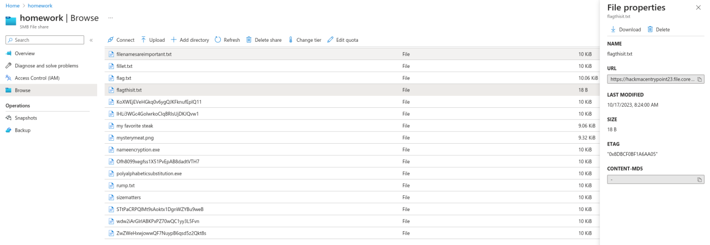
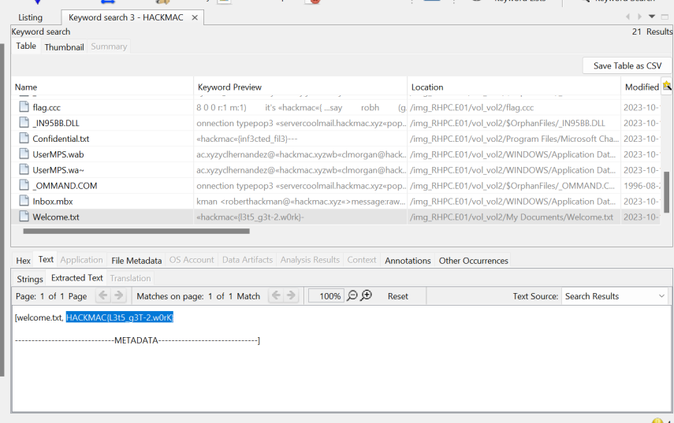
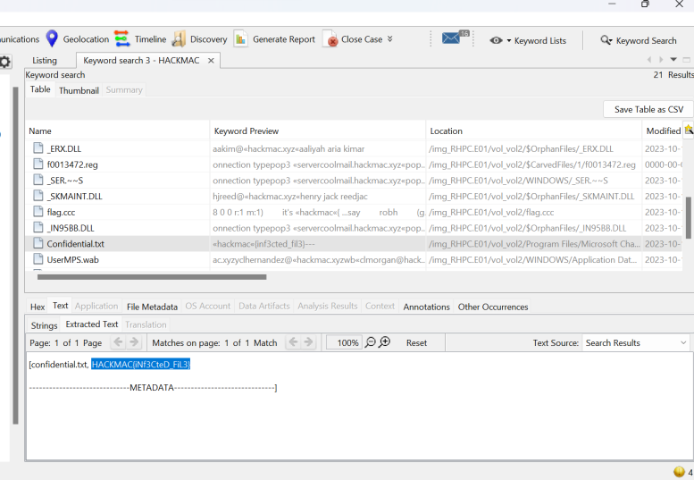
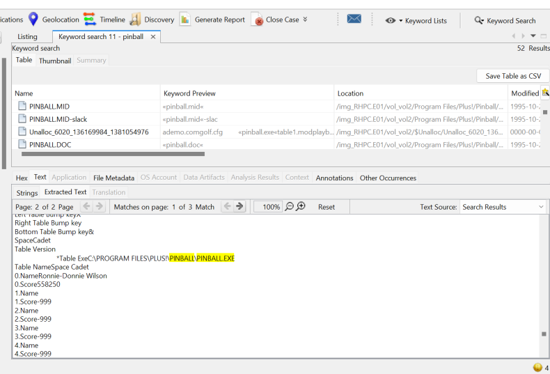

One of my favourite times of year at Macquarie University is [HackMac](https://hackmac.xyz/)! This is an annual Capture the Flag competition that Macquarie University hosts which opened this year to students around NSW including highschool, TAFE, and other universities. This year it was hosted at the Institute of Applied Technology Digital (IATD) at Meadowbank TAFE.

Challenges are made by the awesome MQU IT team as well as students that are are part of Macquarie Universities Professional and Community Engagement unit (PACE). There were a range of challenges from beginner to advanced levels with different categories like OSINT (my personal favourite), reverse engineering, cryptography and more. Not only that but there was also physical hacking too in the form of lockpicks, another favourite of mine. 

My main mission of the day was to get as many challenges as possible as well as learn something new (or multiple things, no pressure). And I achieved this! Last HackMac I was only able to solve a couple challenges as I did not have very much knowledge on these competitions and therefore no clue where to start. This year, I had a little bit more knowledge. 

---

## Challenges
Since I am writing this almost a year later (don't judge me, I'm tired), I do not remember how many challenges I was actually able to do as I also hadn't learnt that documentation of my own challenge solving is genuinely helpful. So please enjoy these small snippets of different challenges!

### Encrypt that Chef
This was a nice starting challenge, I love using CyberChef especially for their Magic feature. It meant that I was able to put in a couple inputs from what I noticed from the inputs that were given and magic the rest.

### Azure 0
This was my first time trying hacking Azure, I didn't get too far and I believe this challenge actually had a set of 5 or 6 challenges. However I was able to get through the first one (mainly because it was simple lookups)! It was really interesting to see how Azure is set up and trying to hack into it. 

### Lost in Installation
This challenge was also my first introduction into Autopsy and I got a small crash course on how to use it from a friend during the competition. This came in really handy with this challenge as what we wanted to find was hidden in the files of an email application. Again, this one was a great beginner challenge to learn how Autopsy works.

### Lost in Redaction
For this challenge we had to find a confidential text file that contained the flag, this one I didn't really have a strategy for outside of just looking for the words HACKMAC and trudging through files that were found.

### Lost in Space
In this challenge we had to actually find the name of the hacker who infected the system. This one took a lot more effort and a lot more trudging through files. We were given a clue that related to the pinball.exe saying that he had the highest score in it. It took me a while to find this file as I was trying to find names rather than just going straight for trying to find the pinball file in the first place.

---

These are not all the challenges I completed and my teammate completed a lot more, including lots of lockpicking (a new skill I acquired during the hackathon!). However, I completely forgot to document half of the challenges we tried so my bad. Overall I really enjoyed this hackathon and learnt a lot like how to use Autopsy, exploring Azure and new lockpicking skills.