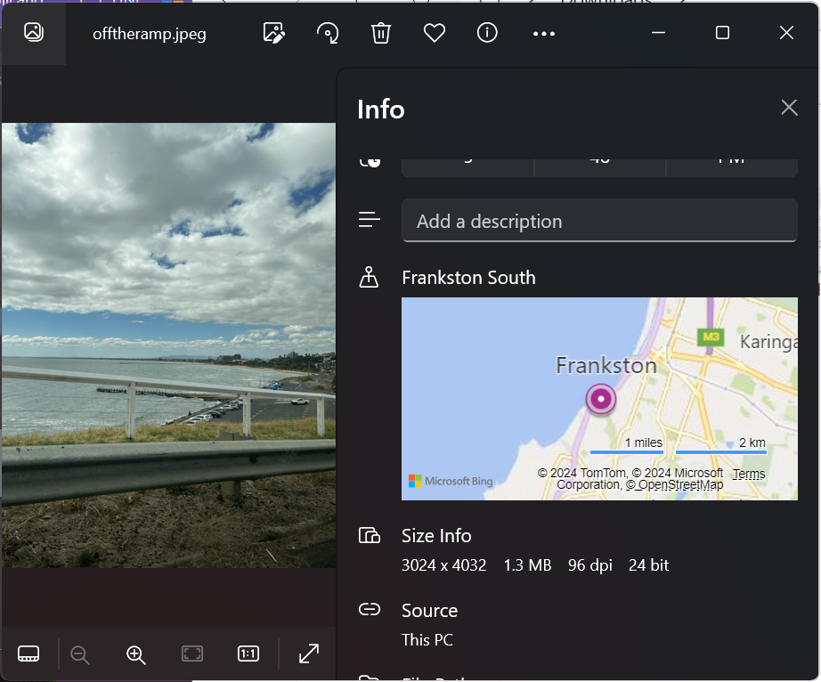

Over the weekend I competed in the [DownUnderCTF](https://downunderctf.com/) with Macquarie Universities Women in Cybersec group. It was an awesome weekend and this is my 2nd time competing in this CTF in this team. It is the largest CTF in the Southern Hemisphere and has an all around great vibe to it of equally challenging but also still educational challenges. This year my main goal was to try and get more challenges completed compared to last year where I was only able to do a couple.

I am so proud of our team, we came 6th in the All-Female category and 26th in Australia! It was an amazing CTF and I learnt a lot about my strengths and weaknesses with different challenges (including the fact that maybe I need to focus a little less on OSINT and a little more on other categories).

Take a look below to see how I solved some challenges!

---

## Challenges


### offtheramp
This was one of the beginner OSINT challenges which had an image of a bridge. My favourite challenges are the geolocation style ones so I was glad to tackle this first. Since the word EXAMINE was highlighted in the description of the challenge, I took a look at the info panel for the image since I'm working on a windows machine. It told me the location was in Frankston South, since I had this general location I just used Google Maps to find the bridge which took a hot second. I ended up finding out it was Olivers Hill Boat Ramp!

**Flag:** DUCTF{Olivers_Hill_Boat_Ramp}




### They're Making Decoys
This was arguably one of my favourite challenges that I was able to complete in the whole CTF. It took me a while to get it but I am so proud of myself for getting it in the end!

```The Sergeant from Clarence asked one of the Corporals to patrol for Emus to keep the our fresh troops on their toes and maybe scare some discipline into them. They headed out to an area with lots of sightings reported though they never made it back. Some of the last images uploaded showed what looked to be the enemy, though it turned out to be decoys. These broom heads are getting clever. I'm guessing we're not getting the camera equipment back...```

This was the description given on the challenge and immediately I was so confused. Initially I started looking for infamous emu statues around Australia but had no luck there. Then I went back to the description to see if I could pick up on any clues. My first clue was that there were lots of sightings of emus. I looked up `emu sighings` on Google and found [this](https://www.clarenceconversations.com.au/coastalemus/maps/coastal-emu-sightings-map#marker-75916) website that tracked all emu sightings. Since they said they saw lots of them in the area, I went straight for areas that had the highest number of emus.

Once that was done I found my next clue from the sight, Brooms Head Road. My interal thoughts at the time: *Oh shoot, that was in the second last sentence in the description of the challenge! I must be getting close.*

From here what I tried to do was go onto Google Maps and scour Brooms Head Road for the statues. Brooms Head Road is LONG though so I gave up on that pretty quickly. Next what I tried to do is see if maybe since I knew the road, I'd find any articles about the emu statues so type in `emu statues brooms head road` and found [this](https://www.facebook.com/groups/156920868310630/posts/761028711233173/?_rdr) Facebook post.

AH HA!

It mentioned Tailem Drive so I looked for that road on Google Maps and BOOM! Found my emus.

I had a bit of technical issues with getting the longitude and latitude (and by technical difficulties, I mean I learnt I cannot read properly) but got the flag eventually!

**Flag:** DUCTF{-29.5505,153.2776}


### Bridget Lives
This was also one I really enjoyed, and one that lead me astray multiple times. This was where I learned not to completely trust Google reverse image search. 

As mentioned, I used Google's reverse image search first to see if I could get a match on the bridge. Instead, I got a match on a totally different bridge! However when I took a closer look at my search I did come across [this video](https://www.youtube.com/watch?v=7p6yqvWUo2M&ab_channel=TheLokes). Hello bridge I'm looking for!

Since the video mentioned the Singapore River and the Warehouse Hotel that's where I went to on Google Maps. I found the bridge pretty quickly ([Robertson Bridge](https://www.google.com/maps/place/Robertson+Bridge/@1.2893832,103.83627,64m/data=!3m1!1e3!4m17!1m10!3m9!1s0x31da197620c11ddf:0x3fcc1c7a544aa568!2sThe+Warehouse+Hotel!5m2!4m1!1i2!8m2!3d1.289177!4d103.837495!16s%2Fg%2F11c594pb_w!3m5!1s0x31da199cf1158809:0x81101a379374cae9!8m2!3d1.2900258!4d103.8364397!16s%2Fg%2F11h6fm2yl7?entry=ttu)). I realised that the bridge name wasn't what we wanted but the building the photo was taken from instead, saw the brickwork from the park across the bridge and determined the photo had to come from the Four Points by Sheraton.

**Flag:** DUCTF{four_points_by_sheraton}

### marketing
I actually hate how long this took for me to find. This was not a difficult challenge, it was more being able to see with your eyes. Thank you to the amazing admins that were very patient with me while I lost my absolute mind over this challenge.

This challenge mainly hinted at the DUCTF marketing so I scoured the social media pages to see if there were any posts that were out of the ordinary. I found the [X](https://x.com/DownUnderCTF/status/1808025512478233062) post with Monke's track on it and figured that was the one but I overlooked it as I didn't see anything immediately.

I continued to scour for posts from this year finding absolutely nothing helpful.

One eternity later... 

I went back to the X post and watched the video again, realising that the Monke photo was different with eyes at the 14 second mark. I then realised, I am a dumb and the flag was right there at the 14 second mark hidden at the very top of the video.

